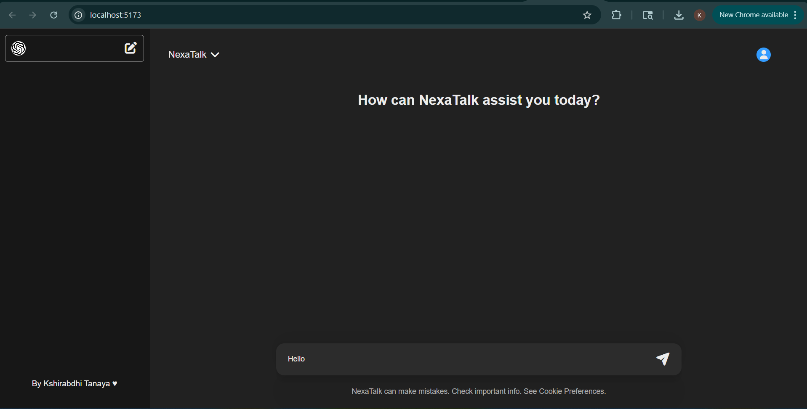
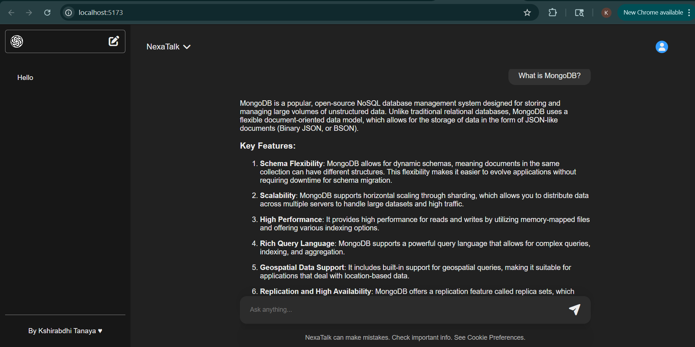

NexaTalk

NexaTalk is an AI-powered conversational web application designed to provide an interactive and modern chat experience using OpenAI integration. The application features a responsive user interface, organized full-stack architecture, and real-time conversational interaction.

🚀 Features

- AI-powered conversational chat system
- Clean and responsive modern UI
- OpenAI API integration
- Real-time user interaction
- MongoDB database connectivity
- Structured frontend and backend architecture
- Scalable full-stack project setup

🛠️ Tech Stack

Frontend
- React.js
- Vite
- CSS

Backend
- Node.js
- Express.js
- MongoDB
- Mongoose

APIs & Tools
- OpenAI API
- Git & GitHub

📁 Project Structure

```bash
NexaTalk/
├── Frontend/
└── Backend/
```

⚙️ Installation & Setup

1. Clone Repository

```bash
git clone https://github.com/Kshirabdhi-Tanaya/NexaTalk.git
```

2. Frontend Setup

```bash
cd Frontend
npm install
npm run dev
```

3. Backend Setup

```bash
cd Backend
npm install
npm start
```

🔐 Environment Variables

Create a `.env` file inside the `Backend` folder and add:

```env
MONGODB_URI=your_mongodb_uri
OPENAI_API_KEY=your_openai_api_key
PORT=5001
```

📌 Future Enhancements

- User authentication system
- Persistent chat history
- Dark / Light theme support
- Streaming AI responses
- Improved UI animations
- Deployment and live hosting

📸 Screenshots

Main Interface



Chat Interface



👩‍💻 Author

Kshirabdhi Tanaya Sahoo

⭐ Support

If you like this project, consider giving it a star on GitHub.